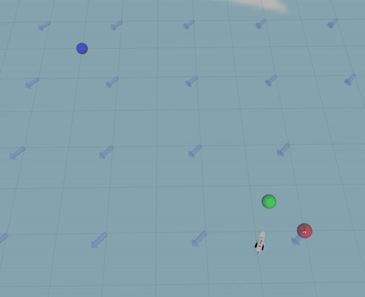
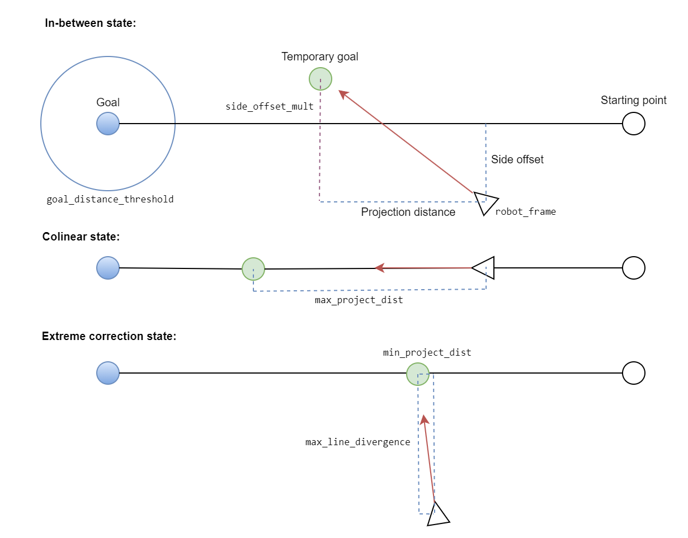

 # Simple Projecting Line Planner

[](https://opensource.org/licenses/MIT)

A local planner that takes two goals (last and next), and follows a projected goal that keeps it close to the line segment between the two goals. Designed to resist strong side forces, such as from wind or water current.



## Params

Note that min speed should be less or equal to max speed.

```xml
<node name="line_planner" pkg="line_planner" type="line_planner_node.py" output="screen">

	<param name="publish_debug_markers" value="true"/>

	<param name="max_turning_velocity" value="0.9"/>
	<param name="max_linear_velocity" value="0.45"/>

	<!-- If base_link is this far away from the line, the projected distance will be min and scale to max when it's on the line.-->
	<param name="max_line_divergence" value="1.0"/>

	<param name="min_project_dist" value="0.15"/>
	<param name="max_project_dist" value="1.2"/>

	<!-- Distance at which the goal is considered reached.-->
	<param name="goal_distance_threshold" value="0.6"/>

	<!-- PID params for heading control.-->
	<param name="P" value="3.0"/>
	<param name="I" value="0.001"/>
	<param name="D" value="65.0"/>

	<!-- Update rate, should be about the same as localization rate.-->
	<param name="rate" value="30"/>

	<!-- If we make no or negative progress for this long, the goal is aborted. (seconds)-->
	<param name="abort_timeout" value="30.0"/>

</node>
```

Here's a diagram showing the possible states of the planner, and which distances each parameter affects:




## Subscribed Topics

- `/move_base_simple/goal` (PoseStamped), takes the current position as the starting point and moves towards the goal

- `/move_base_simple/clear` (Empty), stops all movement immediately

- `/move_base_simple/waypoints` (Path), takes each two consecutive points and navigates along the line between them

## Published Topics

- `/cmd_vel` (JointState), publishes velocity for both wheels/tracks/propellers

- `line_planner/active` (Bool), publishes the acitvity state of the planner

- `line_planner/plan` (Path), publishes a nav plan, also the entire route if given

- `line_planner/markers` (MarkerArray), publishes debug markers shown above

 ## Dynamic Reconfigure Params

- `publish_debug_markers` (bool_t), if set to True, the node will publish markers for debugging purposes.

- `max_turning_velocity` (double_t), the maximum velocity at which the robot can turn.

- `max_linear_velocity` (double_t), the maximum linear velocity of the robot.

- `linear_acceleration` (double_t), the linear acceleration/deceleration of the robot.

- `max_line_divergence` (double_t), the maximum distance that the robot can diverge from the line between the goals.

- `min_project_dist` (double_t), the minimum projection distance for the goal.

- `max_project_dist` (double_t), the maximum projection distance for the goal.

- `goal_distance_threshold` (double_t), the distance at which a goal is considered reached.

- `P` (double_t), the proportional gain for the PID controller that controls the heading of the robot.

- `I` (double_t), the integral gain for the PID controller.

- `D` (double_t), the derivative gain for the PID controller.

- `side_offset_mult` (double_t), multiplier for the side projection of the robot's position.

- `rate` (int_t), the rate at which the robot updates its position and velocity.