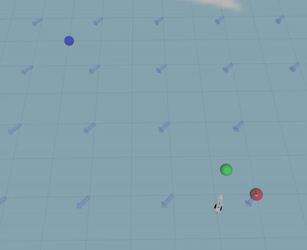

 # Simple Projecting Line Planner

[](https://opensource.org/licenses/MIT)

A local planner that takes two goals (last and next), and follows a projected goal that keeps it close to the line segment between the two goals. Designed to resist strong side forces, such as from wind or water current.



## Params

Note that min speed should be less or equal to max speed.

```xml
<node name="line_planner" pkg="line_planner" type="line_planner_node.py" output="screen">

	<param name="publish_debug_markers" value="true"/>

	<param name="max_turning_velocity" value="0.9"/>
	<param name="max_linear_velocity" value="0.45"/>

	<!-- If base_link is this far away from the line, the projected distance will be min and scale to max when it's on the line.-->
	<param name="max_line_divergence" value="1.0"/>

	<param name="min_project_dist" value="0.15"/>
	<param name="max_project_dist" value="1.2"/>

	<!-- Distance at which the goal is considered reached.-->
	<param name="goal_distance_threshold" value="0.6"/>

	<!-- PID params for heading control.-->
	<param name="P" value="3.0"/>
	<param name="I" value="0.001"/>
	<param name="D" value="65.0"/>

	<!-- Update rate, should be about the same as localization rate.-->
	<param name="rate" value="30"/>

	<!-- If we make no or negative progress for this long, the goal is aborted. (seconds)-->
	<param name="abort_timeout" value="30.0"/>

</node>
```
## Subscribed Topics

 - `/cmd_vel` (Twist), the velocity that needs to be muxed from linear.x and angular.z

 - `/diff_drive/max_speed` (Float32), wheel velocity will be capped at this value

 - `/diff_drive/min_speed` (Float32), non-zero messages won't go slower than this to prevent motor stall

## Published Topics

- `/diff_drive` (JointState), publishes velocity for both wheels/propellers
